# qwraps2: Graphics

There are several graphics generated within qwraps2. The naming
convention for the “quick” plots was inspired by the (deprecated)
*[ggplot2](https://cran.r-project.org/package=ggplot2)* function
`qplot`. The development, flexibility, and robustness of these functions
vary. Some “tips and tricks” are provided.

## qacf: Autocorrelation Plots

Generate an example data set.

``` r

set.seed(42)
n <- 250
x1 <- x2 <- x3 <- x4 <- vector('numeric', length = n)
x1[1] <- runif(1)
x2[1] <- runif(1)
x3[1] <- runif(1)
x4[1] <- runif(1)

# white noise
Z.1 <- rnorm(n, 0, 1)
Z.2 <- rnorm(n, 0, 2)
Z.3 <- rnorm(n, 0, 5)

for(i in 2:n)
{
  x1[i] <- x1[i-1] + Z.1[i] - Z.1[i-1] + x4[i-1] - x2[i-1]
  x2[i] <- x2[i-1] - 2 * Z.2[i] + Z.2[i-1] - x4[i-1]
  x3[i] <- x3[i-1] + x2[i-1] + 0.2 * Z.3[i] + Z.3[i-1]
  x4[i] <- x4[i-1] + runif(1, 0.5, 1.5) * x4[i-1]
}
testdf <- data.frame(x1, x2, x3, x4)

# Base acf plot for one variable
acf(testdf$x1)
```

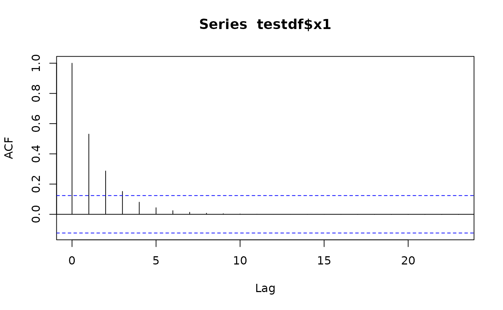

``` r


# qacf plot for one variable
qacf(testdf$x1)
```


``` r

qacf(testdf$x1, show_sig = TRUE)
```

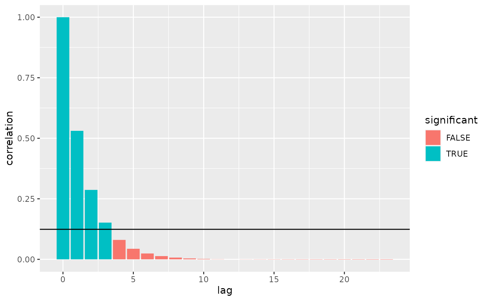

``` r

# more than one variable
acf(testdf)
```

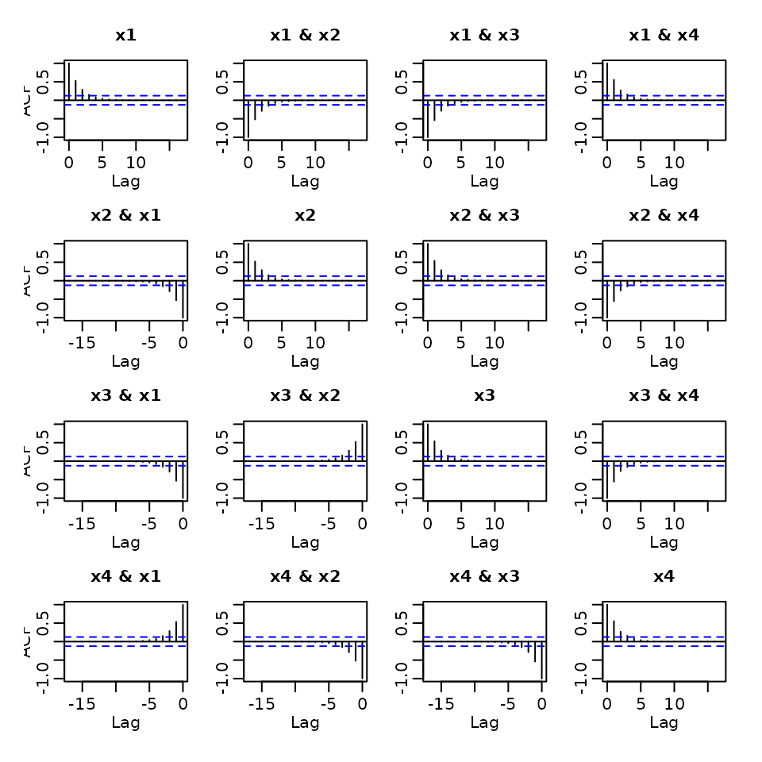

``` r

qacf(testdf)
```

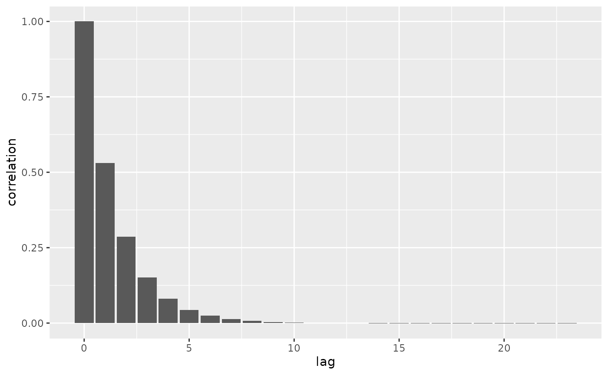

``` r

qacf(testdf, show_sig = TRUE)
```

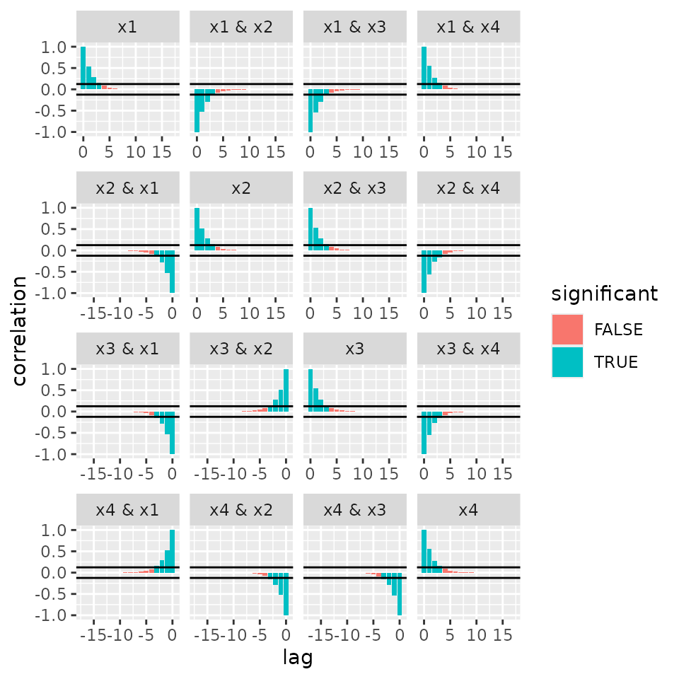

### Tips and tricks

The implementation of qacf is based on the use of
[`stats::acf`](https://rdrr.io/r/stats/acf.html) to produce the
statistics needed for the plot. If you want to get at the data itself to
build your own acf plot you can extract the data frame from the qacf
return:

``` r

acf_plot_data <- qacf(testdf)$data
head(acf_plot_data)
##   lag variable      value significant facets
## 1   0       V1 1.00000000        TRUE     x1
## 2   1       V1 0.53067306        TRUE     x1
## 3   2       V1 0.28669463        TRUE     x1
## 4   3       V1 0.15161298        TRUE     x1
## 5   4       V1 0.08015682       FALSE     x1
## 6   5       V1 0.04355315       FALSE     x1
```

## qblandaltman: Bland Altman Plot

Introduced in \[@altman1983measurement\] and \[@bland1986statistical\],
the qblandaltman method builds ggplot2 style Bland Altman plots. For
examples we use the provided pefr data set which was transcribed from
\[@bland1986statistical\]. See
[`vignette("qwraps2-data-sets", package = "qwraps2")`](http://www.peteredewitt.com/qwraps2/articles/qwraps2-data-sets.md)
For more details on that data set.

The following replicates the figures in \[@bland1986statistical\].

Using the first measurement only:

``` r

pefr_m1 <-
  cbind("Large" = pefr[pefr$measurement == 1 & pefr$meter == "Wright peak flow meter", "pefr"],
        "Mini"  = pefr[pefr$measurement == 1 & pefr$meter == "Mini Wright peak flow meter", "pefr"])
```

A standard x-y style plot and a correlation coefficient suggests that
the two meters provide reasonably similar results.

``` r

cor(pefr_m1)
##           Large      Mini
## Large 1.0000000 0.9432794
## Mini  0.9432794 1.0000000

ggplot2::ggplot(data = as.data.frame(pefr_m1)) +
  ggplot2::aes(x = Large, y = Mini) +
  ggplot2::geom_point() +
  ggplot2::xlab("Large Meter") +
  ggplot2::ylab("Mini Meter") +
  ggplot2::xlim(0, 800) +
  ggplot2::ylim(0, 800) +
  ggplot2::geom_abline(slope = 1)
```

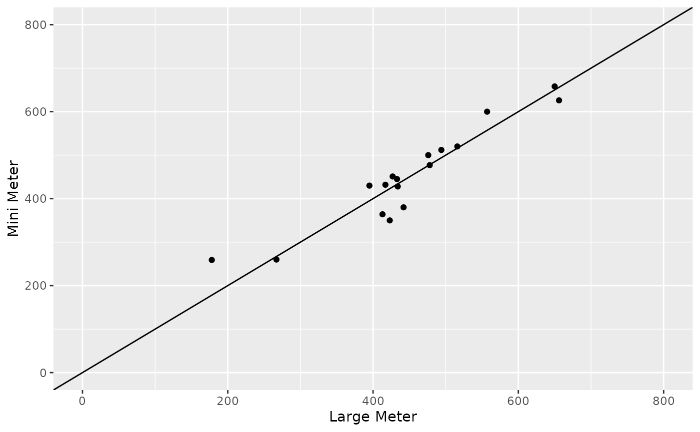

However, for many reasons, the above is misleading. One simple note:
correlation is not a metric for agreement, i.e., perfect agreement would
be shown if all the data points fell on the line of equality whereas
perfect correlation occurs when the data points are simply co-linear.

The Bland Altman plot plots the average value on the x-axis and the
difference in the measurements on the y-axis:

``` r

# default plot
qblandaltman(pefr_m1)
```

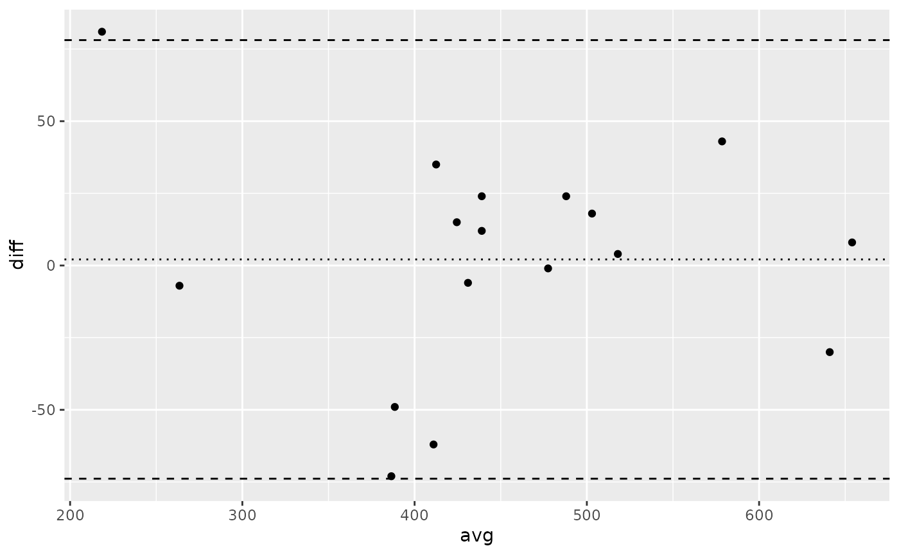

``` r


# modified plot
ggplot2::last_plot() +
  ggplot2::xlim(0, 800) +
  ggplot2::ylim(-100, 100) +
  ggplot2::xlab("Average of two meters") +
  ggplot2::ylab("Difference in the measurements")
```

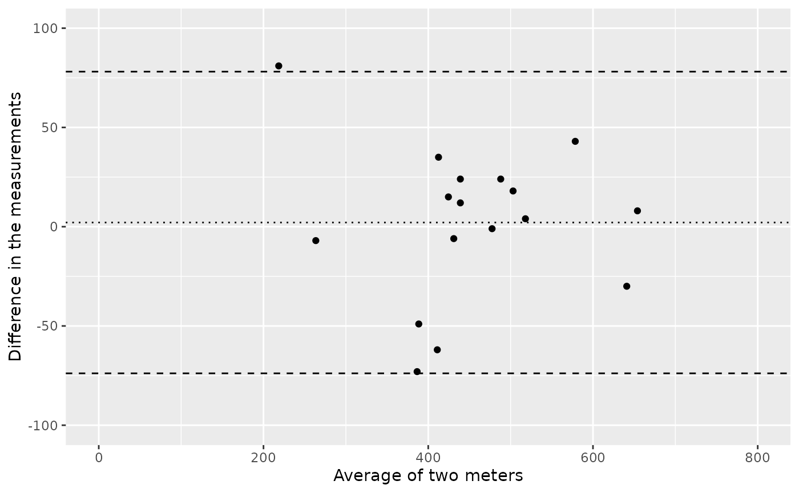

There is no distinct relationship between the differences and the
average, but the difference in the measurements between the two meters
was observed to range between -73 and 81 liters per minute. Such a
discrepancy between the meters is not observable from the simple x-y
plot.

Reliability, or repeatability, of measurements can also be investigated
with a Bland Altman plot.

``` r

pefr_mini <-
  cbind(m1 = pefr[pefr$measurement == 1 & pefr$meter == "Mini Wright peak flow meter", "pefr"],
        m2 = pefr[pefr$measurement == 2 & pefr$meter == "Mini Wright peak flow meter", "pefr"])

qblandaltman(pefr_mini)
```


## qkmplot: Kaplan Meier Plots

``` r

# create a survfit object
leukemia.surv <- survival::survfit(survival::Surv(time, status) ~ x, data = survival::aml)

# base R km plot
plot(leukemia.surv, conf.int = TRUE, lty = 2:3, col = 1:2)
```

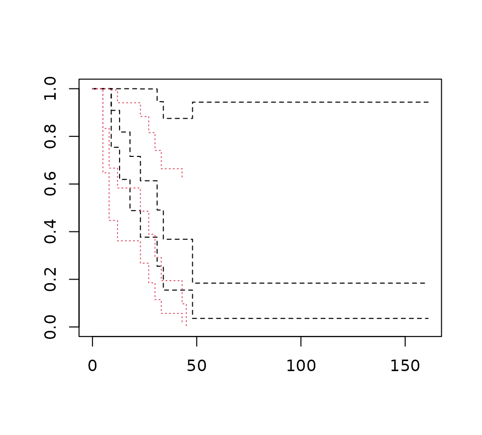

``` r

# qkmplot
qkmplot(leukemia.surv, conf_int = TRUE)
## Warning: Removed 1 row containing non-finite outside the scale range
## (`stat_step_ribbon()`).
```

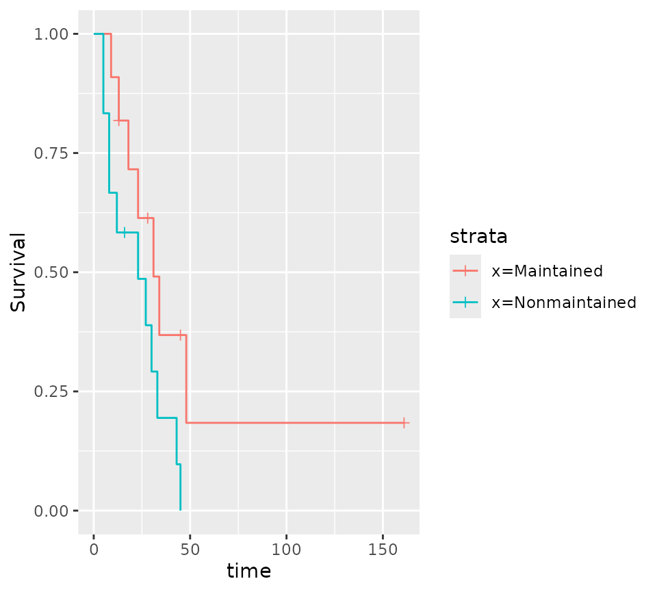

The function `qkmplot_build_data_frame` can be used to generate a
data.frame needed for building a KM plot. This could be helpful for
creating bespoke plots.

``` r

leukemia_km_data <- qkmplot_build_data_frame(leukemia.surv)
head(leukemia_km_data, 3)
##   time n.risk n.event n.censor      surv upper     lower       strata
## 2    0     11       0        0 1.0000000     1 1.0000000 x=Maintained
## 3    9     11       1        0 0.9090909     1 0.7541338 x=Maintained
## 4   13     10       1        1 0.8181818     1 0.6192490 x=Maintained
```

``` r

qkmplot(leukemia_km_data)
```


Intercept only models are easy to plot too.

``` r

intonly_fit <- survival::survfit(survival::Surv(time, status) ~ 1, data = survival::aml)
plot(intonly_fit, conf.int = TRUE)
```


``` r

qkmplot(intonly_fit, conf_int = TRUE)
```

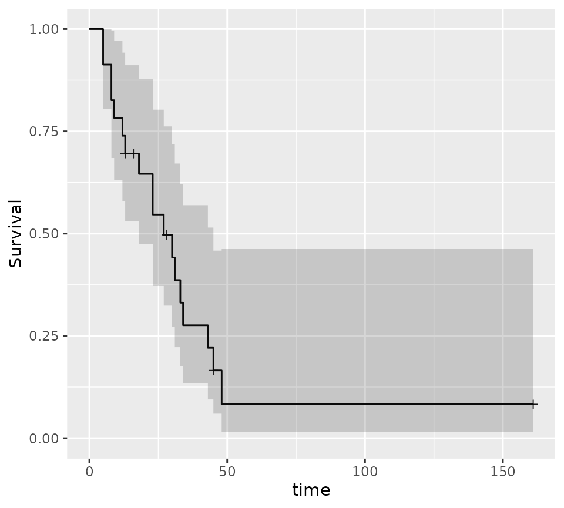

## qroc and qprc: Receiver Operating Characteristic Curve and Precision-Recall Curve

Starting in *qwraps2* version 0.6.0, the methods for building these
graphics have been fundamentally changed as part of a major refactor of
the `confusion_matrix` method which replaces a lot of the code that
`qroc` and `qprc` were built on.

For this work we will consider a couple models for categorizing email as
spam or not spam based on the Spambase \[@spambase\] data. More details
on this data set can be found in the
[`vignette("qwraps2-data-sets", package = "qwraps2")`](http://www.peteredewitt.com/qwraps2/articles/qwraps2-data-sets.md)

Start by defining training and validation splits of the spambase data

``` r

set.seed(42)
tidx <- runif(nrow(spambase)) <= 0.80
xidx <- which(names(spambase) != "spam")
yidx <- which(names(spambase) == "spam")
training_set   <- spambase[tidx, ]
validating_set <- spambase[!tidx, ]
```

Train a few models:

``` r

logistic_model <-
  glm(
    spam ~ .
  , data = training_set
  , family = binomial()
  )
## Warning: glm.fit: fitted probabilities numerically 0 or 1 occurred

ridge_model <-
  glmnet::cv.glmnet(
    y = training_set[, yidx]
  , x = as.matrix(training_set[, xidx])
  , family = binomial()
  , alpha = 0
  )

lasso_model <-
  glmnet::cv.glmnet(
    y = training_set[, yidx]
  , x = as.matrix(training_set[, xidx])
  , family = binomial()
  , alpha = 1
  )
```

Generate the predicted values on the validation set:

``` r

validating_set$logistic_model_prediction <-
  predict(
    logistic_model
  , newdata = validating_set
  , type = "response"
  )

validating_set$ridge_model_prediction <-
  as.numeric(
    predict(
      ridge_model
    , newx = as.matrix(validating_set[, xidx])
    , type = "response"
    , s = "lambda.1se"
    )
  )

validating_set$lasso_model_prediction <-
  as.numeric(
    predict(
      lasso_model
    , newx = as.matrix(validating_set[, xidx])
    , type = "response"
    , s = "lambda.1se"
    )
  )
```

To build ROC and/or PRC plots start by building the confusion matrix for
each model. The qwraps2 function `confusion_matrix` makes this easy.

``` r

cm1 <- confusion_matrix(spam ~ logistic_model_prediction, data = validating_set)
cm2 <- confusion_matrix(spam ~ ridge_model_prediction, data = validating_set)
cm3 <- confusion_matrix(spam ~ lasso_model_prediction, data = validating_set)
```

The ROC and PRC plots are ggplot objects and can be modified as you
would any other ggplot object.

``` r

qroc(cm1) + ggplot2::ggtitle("Logistic Model")
```

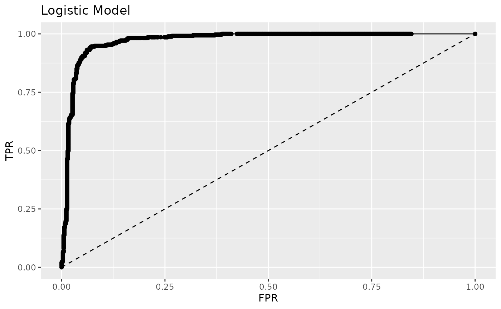

``` r

qroc(cm2) + ggplot2::ggtitle("Ridge Regression Model")
```


``` r

qroc(cm3) + ggplot2::ggtitle("LASSO Regression Model")
```

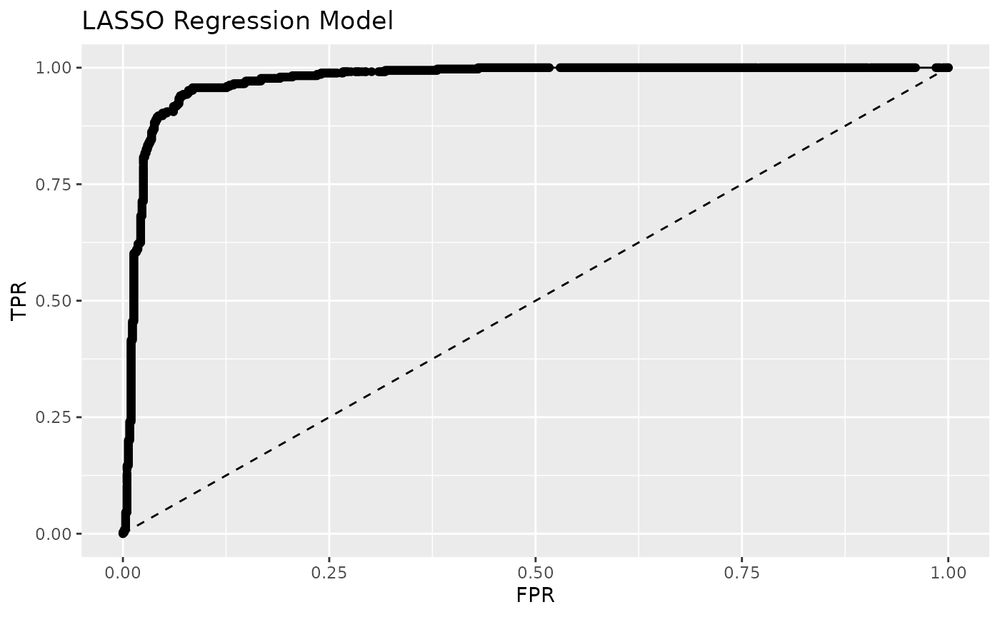

Graphing all three curves in one image with AUROC in the legend:

``` r

roc_plot_data <-
  rbind(
      cbind(Model = paste("Logistic; AUROC =", frmt(cm1$auroc, 3)), cm1$cm_stats)
    , cbind(Model = paste("Ridge; AUROC =",     frmt(cm2$auroc, 3)), cm2$cm_stats)
    , cbind(Model = paste("LASSO; AUROC =",     frmt(cm3$auroc, 3)), cm3$cm_stats)
    )

qroc(roc_plot_data) +
  ggplot2::aes(color = Model) +
  ggplot2::theme(legend.position = "bottom")
```


Similar for PRC:

``` r

qprc(cm1) + ggplot2::ggtitle("Logistic Model")
```

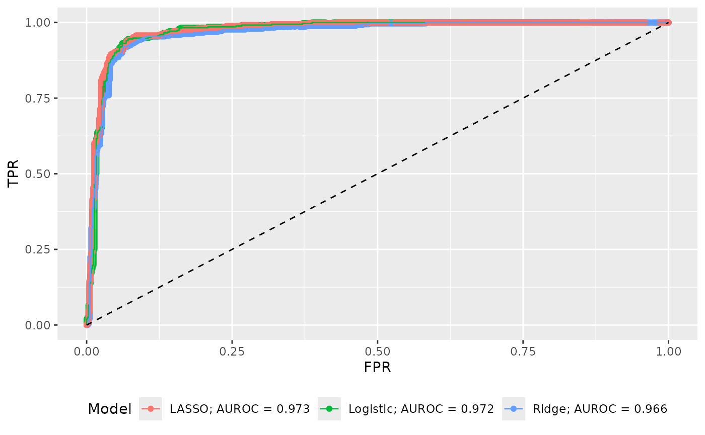

``` r

qprc(cm2) + ggplot2::ggtitle("Ridge Regression Model")
```


``` r

qprc(cm3) + ggplot2::ggtitle("LASSO Regression Model")
```

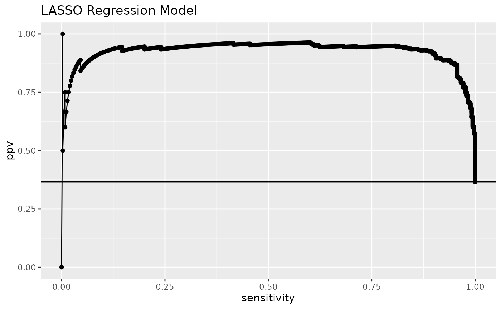

``` r


prc_plot_data <-
  rbind(
      cbind(Model = paste("Logistic; AUPRC =", frmt(cm1$auprc, 3)), cm1$cm_stats)
    , cbind(Model = paste("Ridge; AUPRC =",     frmt(cm2$auprc, 3)), cm2$cm_stats)
    , cbind(Model = paste("LASSO; AUPRC =",     frmt(cm3$auprc, 3)), cm3$cm_stats)
    )

qprc(prc_plot_data) +
  ggplot2::aes(color = Model) +
  ggplot2::geom_hline(yintercept = cm1$prevalence) +
  ggplot2::theme(legend.position = "bottom")
```

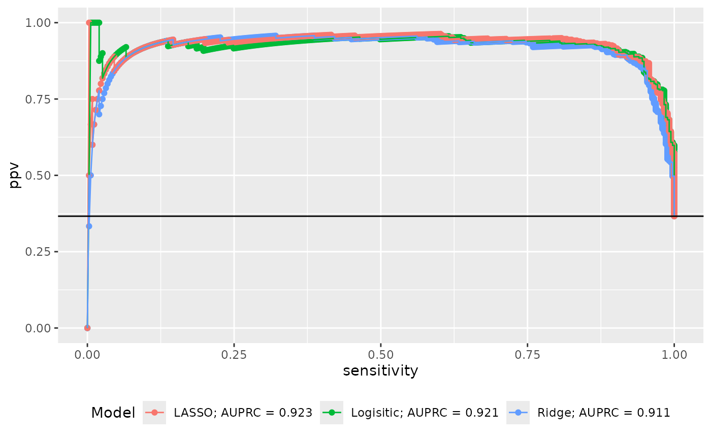

## References

## Session Info

``` r

sessionInfo()
## R version 4.6.0 (2026-04-24)
## Platform: x86_64-pc-linux-gnu
## Running under: Ubuntu 24.04.4 LTS
## 
## Matrix products: default
## BLAS:   /usr/lib/x86_64-linux-gnu/openblas-pthread/libblas.so.3 
## LAPACK: /usr/lib/x86_64-linux-gnu/openblas-pthread/libopenblasp-r0.3.26.so;  LAPACK version 3.12.0
## 
## locale:
##  [1] LC_CTYPE=C.UTF-8       LC_NUMERIC=C           LC_TIME=C.UTF-8       
##  [4] LC_COLLATE=C.UTF-8     LC_MONETARY=C.UTF-8    LC_MESSAGES=C.UTF-8   
##  [7] LC_PAPER=C.UTF-8       LC_NAME=C              LC_ADDRESS=C          
## [10] LC_TELEPHONE=C         LC_MEASUREMENT=C.UTF-8 LC_IDENTIFICATION=C   
## 
## time zone: UTC
## tzcode source: system (glibc)
## 
## attached base packages:
## [1] stats     graphics  grDevices utils     datasets  methods   base     
## 
## other attached packages:
## [1] qwraps2_0.6.3
## 
## loaded via a namespace (and not attached):
##  [1] glmnet_5.0         Matrix_1.7-5       gtable_0.3.6       jsonlite_2.0.0    
##  [5] dplyr_1.2.1        compiler_4.6.0     tidyselect_1.2.1   Rcpp_1.1.1-1.1    
##  [9] jquerylib_0.1.4    splines_4.6.0      systemfonts_1.3.2  scales_1.4.0      
## [13] textshaping_1.0.5  yaml_2.3.12        fastmap_1.2.0      lattice_0.22-9    
## [17] ggplot2_4.0.3      R6_2.6.1           labeling_0.4.3     generics_0.1.4    
## [21] shape_1.4.6.1      knitr_1.51         iterators_1.0.14   htmlwidgets_1.6.4 
## [25] tibble_3.3.1       desc_1.4.3         bslib_0.11.0       pillar_1.11.1     
## [29] RColorBrewer_1.1-3 rlang_1.2.0        cachem_1.1.0       xfun_0.58         
## [33] fs_2.1.0           sass_0.4.10        S7_0.2.2           otel_0.2.0        
## [37] cli_3.6.6          withr_3.0.2        pkgdown_2.2.0      magrittr_2.0.5    
## [41] foreach_1.5.2      digest_0.6.39      grid_4.6.0         lifecycle_1.0.5   
## [45] vctrs_0.7.3        evaluate_1.0.5     glue_1.8.1         farver_2.1.2      
## [49] codetools_0.2-20   ragg_1.5.2         survival_3.8-6     rmarkdown_2.31    
## [53] tools_4.6.0        pkgconfig_2.0.3    htmltools_0.5.9
```
